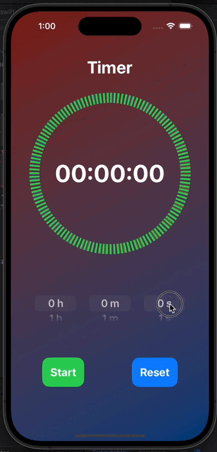

# SwiftUI-Timer



## Overview

**SwiftUI-Timer** is a beautifully designed countdown timer app built using SwiftUI. This app allows users to set a timer for a specific duration and visually see the countdown with a circular progress indicator. The timer's user interface is simple and intuitive, making it easy to use for anyone.

## Features

- **Circular Progress Indicator**: Displays the remaining time visually in a circular format that fills as time progresses.
- **Time Input Controls**: Users can manually set hours, minutes, and seconds using intuitive pickers.
- **Start and Reset Functions**: Easily start or reset the timer with dedicated buttons.
- **Dynamic Timer Display**: The timer dynamically updates to show hours, minutes, and seconds remaining.
- **Customizable UI**: Beautiful gradient background and responsive layout for a modern look.


## Installation

1. **Clone the repository**:
    ```sh
    git clone https://github.com/RanaAk/SwiftUI-Timer.git
    ```
2. **Open the project in Xcode**:
    ```sh
    cd SwiftUI-Timer
    open SwiftUI-Timer.xcodeproj
    ```
3. **Build and run the project**:
    - Select the desired simulator or connect your iOS device.
    - Click the run button or press `Cmd + R` .

## Usage

- **Set Timer**: Use the hour, minute, and second pickers to set the desired duration.
- **Start Timer**: Press the "Start" button to begin the countdown.
- **Reset Timer**: Press the "Reset" button to stop the timer and reset the display.
